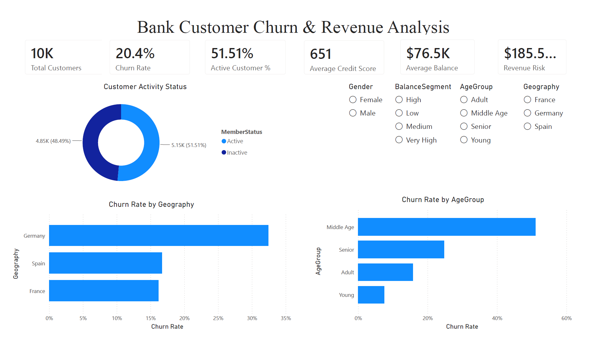
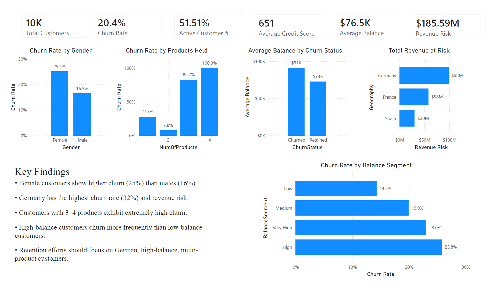
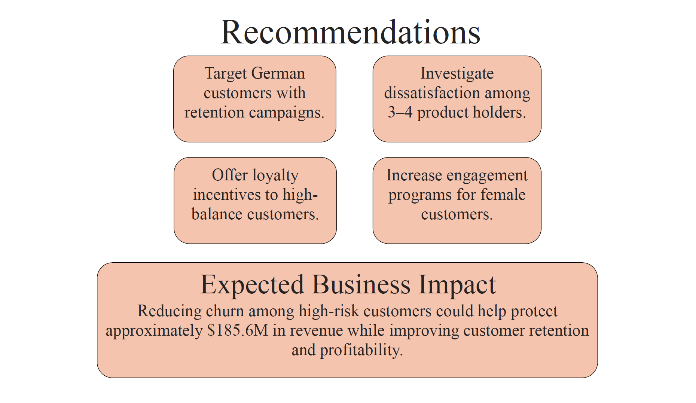

# 🏦 Bank Customer Churn & Revenue Risk Analysis

<p align="center">


</p>

<p align="center">
  <b>Analyzing customer churn patterns and revenue risk using Python, SQL, and Power BI</b>
</p>

---

## 📌 Project Overview

Customer churn is one of the biggest challenges for banks because losing customers directly impacts revenue and profitability.

This project analyzes **10,000 bank customers** to identify:

- High-risk customer segments
- Churn drivers
- Revenue-at-risk segments
- Customer behavior patterns
- Retention opportunities

The project combines:

✅ Python Data Cleaning

✅ SQL Business Analysis

✅ Power BI Dashboards

✅ Business Recommendations

---

## 🛠 Tech Stack

| Tool | Purpose |
|--------|--------|
| Python | Data Cleaning & Feature Engineering |
| Pandas | Data Manipulation |
| MySQL | Business Queries & Analysis |
| Power BI | Dashboard Creation |
| GitHub | Version Control |

---

# 📂 Project Structure

```text
Bank-Churn-Analysis
│
├── data
│   ├── raw
│   └── cleaned
│
├── notebook
│   └── churnanalysis.ipynb
│
├── sql
│   ├── database_setup.sql
│   └── customer_churn_analysis.sql
│
├── dashboard
│   └── Bank_Customer_Churn_Analysis.pbix
│
├── reports
│   └── Dashboard_Report.pdf
│
├── screenshots
│
├── requirements.txt
│
└── README.md
```

---

# ⚙️ Feature Engineering

Created additional business-focused features:

| Feature | Purpose |
|----------|----------|
| AgeGroup | Customer age segmentation |
| BalanceSegment | Customer wealth segmentation |
| RevenueRisk | Revenue exposure estimation |
| CustomerValueScore | Customer importance scoring |

---

# 📊 Executive Dashboard

### Overview Dashboard



---

# 🔍 Customer Churn Deep Dive



---

# 💡 Business Recommendations



---

# 📈 Key Insights

### 🌍 Geography

- Germany recorded the highest churn rate (~32%)
- Germany also contributed the highest revenue risk

### 👩 Gender

- Female customers exhibited higher churn (~25%)
- Male customers showed lower churn (~16%)

### 💳 Products

- Customers with 3–4 products showed extremely high churn rates
- Indicates potential dissatisfaction or service mismatch

### 💰 Balance Segments

- High-balance customers churn more frequently
- Revenue risk is concentrated in high-balance groups

---

# 🎯 Business Recommendations

### Recommendation 1

Target German customers with retention campaigns.

### Recommendation 2

Investigate dissatisfaction among customers holding multiple products.

### Recommendation 3

Offer loyalty programs to high-balance customers.

### Recommendation 4

Increase engagement efforts for female customers.

---

# 📉 Business Impact

This analysis identified approximately:

### 💰 Revenue at Risk

**$185.59 Million**

Potentially recoverable through targeted retention strategies.

---

# 🚀 How To Run

### Clone Repository

```bash
git clone https://github.com/arpittyagi-at/bank-customer-churn-analysis.git
```

### Install Dependencies

```bash
pip install -r requirements.txt
```

### Open Notebook

```bash
jupyter notebook
```

### Open Dashboard

```text
dashboard/Bank_Customer_Churn_Analysis.pbix
```

using Power BI Desktop.

---

# 👨‍💻 Author

**Arpit Tyagi**

B.Tech Electronics & Communication Engineering

SRM University

---

## ⭐ If you found this project useful, consider giving it a star!
